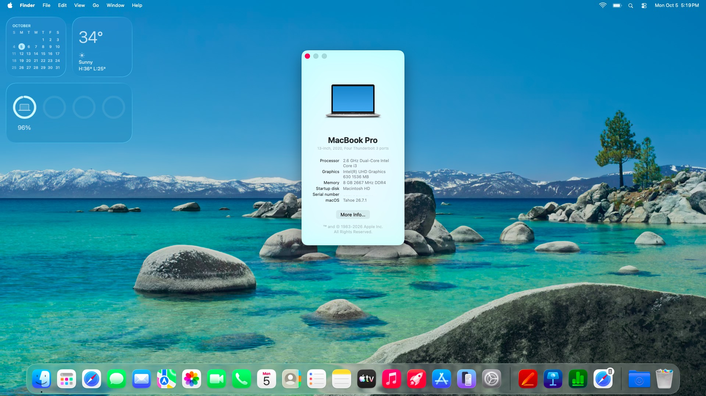

# OpenCore Based Hackintosh EFI for the HP Pavilion 14-dh1178TU
This repository provides working OpenCore EFI configurations for the HP Pavilion x360 Convertible 14-dh1178TU running macOS Tahoe 26.7.1, with touchscreen-enabled and touchscreen-disabled variants.

---


> [!NOTE]
>
> The image shows "MacBook Pro" along with other incorrectly mentioned hardware, this is macOS reporting the configured SMBIOS; the host hardware is the Pavilion. More information regarding the actual hardware is listed below under "System Specifications".

---

## Features
### Working Features
- [x] CPU, memory, Intel UHD graphics acceleration, and the internal display
- [x] Brightness control
- [x] Keyboard, including the corrected key mappings and function keys
- [x] USB ports and webcam
- [x] Trackpad
- [x] Wi-Fi using the Intel AX201 with itlwm and HeliPort
- [x] Bluetooth
- [x] Battery and charging, sleep and wake, and lid close and open
- [x] Audio output and input
- [x] Internal SD card reader using the included CtlnaSDXC workaround

The `EFI-touchscreen` variant enables touchscreen support. The `EFI-no-touchscreen` variant disables it.

### Untested
- [ ] HDMI port

### Not Working
- [ ] Fingerprint reader - due to being incompatible with macOS
- [ ] AirDrop — unavailable with the included `itlwm.kext` and HeliPort configuration.

> [!IMPORTANT]
>
> Wi-Fi requires HeliPort, which is installed after macOS setup. Audio requires a separate VoodooHDA-Tahoe installation; it is not provided by the EFI alone. Steps to set these up are in the "Post-Install" section.

## System Specifications

| Component | Specification | Hardware IDs / Notes |
|---|---|---|
| Laptop | HP Pavilion x360 Convertible 14-dh1xxx | SKU: 231T0PA#ACJ |
| Platform | Intel Comet Lake-U laptop platform | HP baseboard 866E, revision 90.08 |
| Firmware | Insyde BIOS F.18, dated 2024-03-27 | UEFI; SMBIOS 3.2; Secure Boot disabled |
| CPU | Intel Core i3-10110U, 2 cores / 4 threads | Comet Lake-U, 2.10 GHz nominal |
| Memory | 8 GB DDR4-2667 | SK Hynix HMA81GS6CJR8N-XN |
| Integrated graphics | Intel UHD Graphics | PCI `8086:9B41`; HP subsystem `103C:866E` |
| Internal display | LGD060F panel, 1920 × 1080 | Connected to Intel integrated graphics |
| Wi-Fi | Intel Wi-Fi 6 AX201 160 MHz | PCI `8086:02F0`; path `PciRoot(0x0)/Pci(0x14,0x3)` |
| Bluetooth | Intel Wireless Bluetooth | USB `8087:0026` |
| Audio | Realtek audio codec, Windows identifies endpoints as Speaker and Microphone Array | Codec `10EC:0295`; Intel SST controller `8086:02C8`; Intel Display Audio `8086:280B` |
| Trackpad | Synaptics TPFHID, device `SYNA328B` | I²C HID; Intel Serial IO I²C controllers `8086:02E8` and `8086:02E9`; GPIO controller `INT34BB` |
| Touchscreen | ELAN2514, identified by Windows as ELAN EzTouchFilter | ACPI device; enabled only in the touchscreen EFI variant |
| Keyboard | HP PS/2 keyboard device `HPQ8001` | Windows also reports a USB HID keyboard device |
| USB controller | Intel USB 3.1 eXtensible Host Controller | PCI `8086:02ED` |
| Internal SD reader | Intel SD Host Controller | PCI `8086:02F5`; HP subsystem `103C:866E` |
| Internal SSD | KIOXIA BG4 NVMe, 512 GB | Model `KBG40ZNV512G`; controller `1E0F:0001` |
| SATA / PCIe storage controller | Intel Chipset SATA/PCIe RST Premium Controller | PCI `8086:282A`; Windows reports it in RAID mode |
| Fingerprint reader | Synaptics WBDI fingerprint reader | USB `06CB:00CB`; fingerprint support is not included in this EFI |
| Tested macOS | macOS Tahoe 26.7.1 | Project test environment |
| OpenCore | OpenCore 1.0.8 RELEASE | EFI project version |

## BIOS Settings

Ensure you are on the latest BIOS version (Inside F.18 Rev.A), you can get a copy from the [HP Support](https://support.hp.com/rs-en/drivers/hp-pavilion-14-dh1000-convertible-x360-pc-series/model/2100020044) site.
To reach the BIOS page, press and hold the <kbd>F10</kbd> key on boot-up.

### Security

| Option | Recommended setting | Notes |
|---|---|---|
| Intel Software Guard Extensions (SGX) | Disabled | Recommended for this OpenCore setup. |

### Configuration

| Option | Recommended setting | Notes |
|---|---|---|
| Virtualization Technology | Enabled | This is Intel VT-x. |
| Hyper-Threading | Enabled | Allows macOS to use both threads per CPU core. |

### Boot Options

| Option | Recommended setting | Notes |
|---|---|---|
| USB Boot | Enabled | Needed to boot an OpenCore installer or recovery USB. |
| Secure Boot | Disabled | Required for this OpenCore setup. |
| Platform Key | Not Enrolled | Keep Secure Boot keys unenrolled while Secure Boot is disabled. |

## EFI Folder Contents

<details>
<summary><strong>Touchscreen Disabled Variant</strong></summary><br>

```text
EFI
├── BOOT
│   └── BOOTx64.efi
└── OC
    ├── ACPI
    │   ├── SSDT-dGPU-Off.aml
    │   ├── SSDT-EC-USBX-LAPTOP.aml
    │   ├── SSDT-GPI0.aml
    │   ├── SSDT-HP-FixLidSleep.aml
    │   ├── SSDT-I2C0.aml
    │   ├── SSDT-PLUG-DRTNIA.aml
    │   ├── SSDT-PNLF-CFL.aml
    │   ├── SSDT-PS2-ABI.aml
    │   ├── SSDT-PS2.aml
    │   ├── SSDT-RTCAWAC.aml
    │   ├── SSDT-TPL1-DISABLE.aml
    │   └── SSDT-XOSI.aml
    ├── Drivers
    │   ├── HfsPlus.efi
    │   ├── OpenCanopy.efi
    │   ├── OpenRuntime.efi
    │   └── ResetNvramEntry.efi
    ├── Kexts
    │   ├── BlueToolFixup.kext
    │   ├── BrightnessKeys.kext
    │   ├── CtlnaSDXC.kext
    │   ├── IntelBluetoothFirmware.kext
    │   ├── IntelBTPatcher.kext
    │   ├── itlwm.kext
    │   ├── Lilu.kext
    │   ├── NVMeFix.kext
    │   ├── SMCBatteryManager.kext
    │   ├── SMCProcessor.kext
    │   ├── USBToolBox.kext
    │   ├── UTBMap.kext
    │   ├── VirtualSMC.kext
    │   ├── VoodooI2C.kext
    │   │   ├── VoodooGPIO.kext
    │   │   ├── VoodooI2CServices.kext
    │   │   └── VoodooInput.kext
    │   ├── VoodooI2CHID.kext
    │   ├── VoodooPS2Controller.kext
    │   │   ├── VoodooInput.kext
    │   │   ├── VoodooPS2Keyboard.kext
    │   │   ├── VoodooPS2Mouse.kext
    │   │   └── VoodooPS2Trackpad.kext
    │   ├── VoodooRMI.kext
    │   │   ├── RMII2C.kext
    │   │   ├── RMISMBus.kext
    │   │   └── VoodooInput.kext
    │   └── WhateverGreen.kext
    ├── Resources
    │   ├── Audio (350 files; omitted from tree)
    │   ├── Font (4 files; omitted from tree)
    │   ├── Image (image files omitted from tree)
    │   └── Label (22 files; omitted from tree)
    ├── Tools
    │   └── OpenShell.efi
    ├── config.plist
    └── OpenCore.efi
```

</details>

<details>
<summary><strong>Touchscreen Variant</strong></summary><br>

```text
EFI
├── BOOT
│   └── BOOTx64.efi
└── OC
    ├── ACPI
    │   ├── SSDT-dGPU-Off.aml
    │   ├── SSDT-EC-USBX-LAPTOP.aml
    │   ├── SSDT-GPI0.aml
    │   ├── SSDT-HP-FixLidSleep.aml
    │   ├── SSDT-I2C0.aml
    │   ├── SSDT-PLUG-DRTNIA.aml
    │   ├── SSDT-PNLF-CFL.aml
    │   ├── SSDT-PS2-ABI.aml
    │   ├── SSDT-PS2.aml
    │   ├── SSDT-RTCAWAC.aml
    │   ├── SSDT-TPL1-DISABLE.aml
    │   └── SSDT-XOSI.aml
    ├── Drivers
    │   ├── HfsPlus.efi
    │   ├── OpenCanopy.efi
    │   ├── OpenRuntime.efi
    │   └── ResetNvramEntry.efi
    ├── Kexts
    │   ├── BlueToolFixup.kext
    │   ├── BrightnessKeys.kext
    │   ├── CtlnaSDXC.kext
    │   ├── IntelBluetoothFirmware.kext
    │   ├── IntelBTPatcher.kext
    │   ├── itlwm.kext
    │   ├── Lilu.kext
    │   ├── NVMeFix.kext
    │   ├── SMCBatteryManager.kext
    │   ├── SMCProcessor.kext
    │   ├── USBToolBox.kext
    │   ├── UTBMap.kext
    │   ├── VirtualSMC.kext
    │   ├── VoodooI2C.kext
    │   │   ├── VoodooGPIO.kext
    │   │   ├── VoodooI2CServices.kext
    │   │   └── VoodooInput.kext
    │   ├── VoodooI2CHID.kext
    │   ├── VoodooPS2Controller.kext
    │   │   ├── VoodooInput.kext
    │   │   ├── VoodooPS2Keyboard.kext
    │   │   ├── VoodooPS2Mouse.kext
    │   │   └── VoodooPS2Trackpad.kext
    │   ├── VoodooRMI.kext
    │   │   ├── RMII2C.kext
    │   │   ├── RMISMBus.kext
    │   │   └── VoodooInput.kext
    │   └── WhateverGreen.kext
    ├── Resources
    │   ├── Audio (350 files; omitted from tree)
    │   ├── Font (4 files; omitted from tree)
    │   ├── Image (image files omitted from tree)
    │   └── Label (22 files; omitted from tree)
    ├── Tools
    │   └── OpenShell.efi
    ├── config.plist
    └── OpenCore.efi
```

</details>

## Pre-Install

### Prerequisites 

* A USB flash drive of size 32 GB or higher.
* A stable OS to make the installer.
* An offline macOS installer, or have a wired internet connection if using an online installer, as WiFi via HeliPort is setup post-install.

### EFI Adjustments

Choose either the **Touchscreen** or **Touchscreen Disabled** EFI. The touchscreen-disabled configuration enables `SSDT-TPL1-DISABLE.aml` and disables `VoodooI2CHID.kext`; the touchscreen configuration does the reverse.

Before use, generate unique SMBIOS values for the model already set (`MacBookPro16,2`). 

Populate: `PlatformInfo → Generic → SystemSerialNumber`
          `PlatformInfo → Generic → MLB`
          `PlatformInfo → Generic → SystemUUID`
          `PlatformInfo → Generic → ROM`
To generate SMBIOS values you may use [GenSMBIOS](https://github.com/corpnewt/GenSMBIOS)

> [!IMPORTANT]
>
> Do not change the SMBIOS model unless explicitly required for your setup.

This EFI was tested on macOS Tahoe 26.7.1. Other macOS versions are untested; verify OpenCore and every included kext against the intended version before using it. The configuration has no `MinKernel` or `MaxKernel` filters, add version limits or swap kexts only with testing.

These configurations are specific to the HP Pavilion x360 Convertible 14-dh1178tu. Compatibility with other 14-dh1xxx models has not been established; their hardware and firmware differences may require a separately validated EFI.

AirportItlwm is a possible alternative worth investigating for Apple wireless features, but it is not included or tested in this EFI. Tahoe compatibility and AirDrop functionality are not guaranteed.

### Making the USB

* Follow [Dortania's OpenCore Install Guide](https://dortania.github.io/OpenCore-Install-Guide/installer-guide/#making-the-installer) to make the USB installer if not already made.
* Download the latest version of [HeliPort](https://github.com/OpenIntelWireless/heliport) and copy the .dmg to the installer.
* Mount the ESP (EFI System Partition), and add the EFI folder to the ESP.
  Make sure to rename your EFI folder exactly "EFI".

## Installation Process

* Restart your system and press <kbd>F9</kbd> to open the boot menu.
* Select your USB drive.
* In the OpenCore boot-picker select your installer and continue with the installation process.

> [!NOTE]
>
> You may need to open the boot-menu each time the installer restarts to avoid booting into Windows.

## Post-Install

Once macOS has been installed you will need to carry out some things to complete the setup.

> [!IMPORTANT]
>
> In setup, you must choose "My mac does not connect to the internet" when prompted.

### Moving the EFI to the host ESP

* In the macOS terminal find your ESP via `diskutil list` usually `/dev/disk0s1`.
* Mount the ESP with `sudo diskutil mount /dev/diskXs1` (replace X with your disk).
* Copy the BOOT and OC folder to the EFI folder inside the ESP.

> [!CAUTION]
>
> If you are dual-booting with Windows **do not delete the `Microsoft` folder in the EFI folder**, it is required by Windows to boot.

### Setting Up HeliPort

* Use the .dmg we copied to the installer to install the HeliPort app.
* Once installed, a second WiFi icon should appear on the menu bar, click it and select your WiFi.
* Additionally, you can add HeliPort as a login item in System Settings.

### Setting up VoodooHDA

* Install a copy of [VoodooHDA-Tahoe](https://github.com/chris1111/VoodooHDA-Tahoe).
* Use the provided Package.command to make the .pkg file.
* Run the .pkg file and follow the steps in the installer.
* After rebooting under `System Settings > Audio` make sure to select the correct output/input device.

## Troubleshooting/Post-Install Tips

* After installation, the fn row keys may not be properly mapped, you may use a tool like Karabiner Elements to map your keys.
* If HP boots straight into Windows, press <kbd>Esc</kbd>, then <kbd>F9</kbd>, and select **Boot from EFI File → EFI → BOOT → BOOTx64.efi** on the internal EFI partition. To make OpenCore the default, set `Misc → Boot → LauncherOption` to `Short` in the internal config.plist (`RequestBootVarRouting` should remain `enabled`), then launch OpenCore once from that EFI. If needed, prioritize its new boot entry in BIOS.
* If using the trackpad, in rare cases, the trackpad may also press, to stop this Open `Apple menu → System Settings → Trackpad → Point & Click`. Turn `Tap to click` off.

## Credits
* **Acidanthera** for OpenCore and most of the kexts.
* **CorpNewt** for ProperTree and GenSMBIOS.
* **Elmaleek03** for the base EFI.
* **Dortania** for their detailed install guide.
* **Chris1111** for VoodooHDA-Tahoe.
* **OpenIntelWireless** / **zxystd** for itlwm, IntelBluetoothFirmware, and IntelBTPatcher.
* **Dhinak G.** for USBToolBox and UTBMap.
* **Alexandre Daoud**, **CoolStar**, **Kishor Prins**, and **1Revenger1** for the respective VoodooI2C, VoodooGPIO, VoodooInput, and VoodooRMI components.
* **Apple** for CtlnaSDXC.kext and obviously macOS itself.
* **HP** for the Pavilion :)
* And anyone else who helped to develop and improve hackintoshing.
